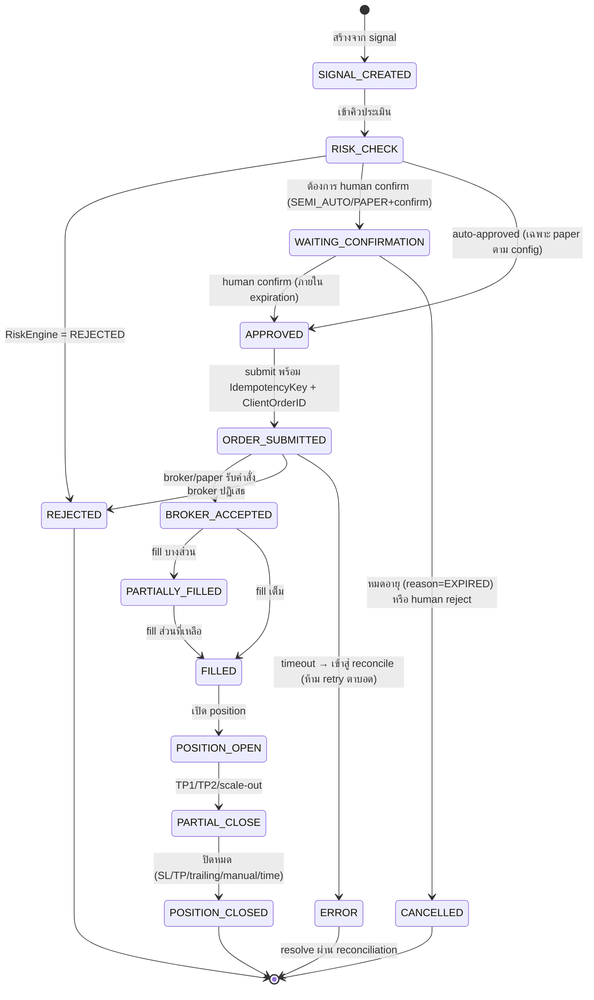

# 03 — Trading Domain Model (โมเดลโดเมนการเทรด)

| รายการ | รายละเอียด |
|---|---|
| เอกสาร | docs/03-trading-domain.md |
| เวอร์ชัน | 1.0 (2026-09-08) |
| สถานะ | ✅ Baseline — ชื่อ Entity/Enum ในเอกสารนี้เป็นมาตรฐานเดียวของ codebase |

---

## 1. Domain Entities ( Glossary )

| Entity | คำอธิบาย |
|---|---|
| **Symbol** | สินท้าทายการเทรด (XAUUSD, EURUSD, …) พร้อม contract spec (digits, contract_size, tick_value, session hours) |
| **Tick** | ราคา ณ เวลาหนึ่ง (bid, ask, spread, volume?, timestamp) |
| **Candle** | OHLCV ต่อ (symbol, timeframe, bucket_start) — M1 เป็น base ของ TF ที่สูงขึ้น |
| **SwingPoint** | Swing High/Low ที่ตรวจพบ (type: HIGH/LOW, internal/external, price, time) |
| **StructureEvent** | BOS / CHoCH / MSS พร้อมทิศทางและระดับราคาที่ทำลาย |
| **LiquidityLevel** | ระดับสภาพคล่อง (PDH, PDL, PWH, PWL, Asian/London/NY H/L, EQH, EQL) |
| **LiquiditySweep** | เหตุการณ์ราคากวาด/แตะ liquidity (sweep/grab + direction) |
| **Zone** | SMC zones: Order Block, Breaker Block, FVG, IFVG (top, bottom, direction, mitigated?) |
| **MarketRegime** | สถานะตลาดต่อ timeframe (enum ด้านล่าง) + confidence |
| **MarketBias** | ผลรวม top-down ต่อ symbol: BULLISH / BEARISH / NEUTRAL + เหตุผลราย TF |
| **Session** | ช่วงเวลาตลาด (ASIAN / LONDON / NEW_YORK + overlap) |
| **Strategy** | นิยาม strategy (code, name, entry/invalidation/SL/TP/risk/session/regime rules) |
| **StrategyConfig** | config ต่อ (strategy, trading_mode, account) — parameters, enable/disable |
| **Signal** | ผลจาก strategy ที่ผ่าน confluence — มีวงจรชีวิตของตัวเอง |
| **SignalEvidence** | หลักฐานยืนยันของ signal (source, type, detail, weight) |
| **TradePlan** | แผนเทรดครบองค์ประกอบของ signal (entry, entry_zone, SL, TP1-3, RR, risk%, size, session, invalidation, expiration) |
| **AIAnalysis** | ผลการวิเคราะห์รวมของ AI ต่อ (symbol, timeframe set) — bias, confidence, narrative, recommendation |
| **AIAgentResult** | ผลของ agent แต่ละตัว (agent_name, output JSON, evidence) |
| **RiskDecision** | ผลการประเมินของ Risk Engine (status, reasons[]) |
| **RiskConfig** | ชุดกฎความเสี่ยงที่ใช้งาน (ต่อ account) |
| **KillSwitch** | สถานะ kill switch (state, trigger, triggered_at, reset_by) |
| **Order** | คำสั่งซื้อขาย (paper หรือ broker) — state machine ด้านล่าง |
| **OrderEvent** | บันทึกทุก state transition ของ order |
| **Position** | ตำแหน่งที่เปิดอยู่/ปิดแล้ว (side, size, entry, SL, TP, partial plan, trailing state) |
| **PositionEvent** | บันทึกทุกการเปลี่ยนแปลงของ position (BE move, partial close, modify, close) |
| **Trade** | ผลการเทรดที่ปิดแล้ว (exit, PnL, MFE, MAE, duration, exit_reason) |
| **PaperAccount / PaperOrder / PaperPosition** | เงื่อนไข virtual ของ paper trading (แยกจาก live เพื่อความชัดเจน) |
| **Account** | บัญชีผู้ใช้ฝั่งระบบ (balance ฐานสำหรับ risk ของ paper) |
| **BrokerConnection** | การเชื่อมต่อ broker (broker_type, credentials เข้ารหัส, status) |
| **EconomicEvent** | เหตุการณ์เศรษฐกิจ (type, impact, time) + NewsWindow ที่คำนวณไว้ |
| **Alert** | การแจ้งเตือน (type, severity, payload, read?) |
| **JournalEntry** | บันทึก trade journal (auto + manual fields) |
| **BacktestRun / BacktestTrade** | ผลการรัน backtest |
| **AuditLog / SystemEvent** | ร่องรอยการตรวจสอบ / เหตุการณ์ระบบ |

## 2. Enums (มาตรฐานเดียวทั้งระบบ)

```text
TradingMode        = BACKTEST | PAPER | SEMI_AUTO | LIVE          # config ระบบ (G-03)
TradingStyle       = SCALP | DAY_TRADE | SWING | RUN_TREND        # รูปแบบการเทรดต่อ plan
Timeframe          = M1 | M3 | M5 | M15 | M30 | H1 | H4 | D1 | W1
OrderSide          = BUY | SELL                                   # LONG=BUY, SHORT=SELL
OrderType          = MARKET | LIMIT
TimeInForce        = GTC | DAY
MarketRegime       = TRENDING_UP | TRENDING_DOWN | RANGING | HIGH_VOLATILITY
                   | LOW_VOLATILITY | BREAKOUT | PULLBACK | NEWS_CONDITION | UNKNOWN
MarketBias         = BULLISH | BEARISH | NEUTRAL
StructureType      = BOS | CHoCH | MSS
StructureScope     = INTERNAL | EXTERNAL
SwingType          = HH | HL | LH | LL
LiquiditySide      = BUY_SIDE | SELL_SIDE
ZoneType           = ORDER_BLOCK | BREAKER_BLOCK | FVG | IFVG
SessionType        = ASIAN | LONDON | NEW_YORK | OVERLAP | OFF_HOURS
SignalStatus       = ACTIVE | WAITING_CONFIRMATION | CONFIRMED | REJECTED | EXPIRED | CANCELLED
RiskDecisionStatus = APPROVED | REJECTED | REDUCE_SIZE | WAIT
OrderState         = (state machine ด้านล่าง)
PositionState      = PENDING | OPEN | PARTIALLY_CLOSED | CLOSED
ExitReason         = SL | TP | PARTIAL_TP | TRAILING_STOP | TIME_STOP | MANUAL | STRUCTURE_STOP | EXPIRED
KillSwitchState    = ACTIVE | TRIGGERED
AlertSeverity      = INFO | WARNING | CRITICAL
Role               = ADMIN | TRADER | VIEWER
BrokerType         = PAPER | MT5 | OANDA | SAXO                   # v1: PAPER, MT5(demo)
```

## 3. State Machines

### 3.1 Order Lifecycle (OMS)



**กฎ transition:**
- ทุก transition บันทึกลง `order_events` (from_state, to_state, actor, reason, correlation_id) + audit
- Invalid transition ถูกปฏิเสธ (raise + alert) — ไม่มีการ "ข้ามสถานะ"
- Transition ERROR ต้อง resolve ผ่าน reconciliation เท่านั้น

### 3.2 Signal Lifecycle

```
ACTIVE (สร้าง + risk APPROVED)
  → WAITING_CONFIRMATION (แสดงใน AI Panel / Trading Screen)
  → CONFIRMED (human กดยืนยัน → สร้าง order) | REJECTED (human ปฏิเสธ + reason) | EXPIRED (เกิน expiration)
CANCELLED ได้จาก ACTIVE/WAITING_CONFIRMATION (เช่น invalidation โดนแตะก่อน)
```

### 3.3 Position Lifecycle

```
PENDING (order รอ fill) → OPEN → PARTIALLY_CLOSED → CLOSED
ทุกการเปลี่ยนแปลง (BE/trailing/partial/modify) = PositionEvent + audit
```

## 4. Domain Invariants (กฎที่ระบบต้อง enforce เสมอ)

| ID | Invariant | จุด enforce |
|---|---|---|
| INV-01 | ทุก order ต้องผ่าน RiskEngine.evaluate() และได้ APPROVED (หรือ REDUCE_SIZE แล้วปรับ size) ก่อน submit | OrderService.submit() — มี architectural test กัน bypass |
| INV-02 | AI output ไม่มีทางไปถึง BrokerAdapter โดยตรง — ต้องผ่าน Signal → Risk → (Confirm) → OMS | module boundary + import-lint test |
| INV-03 | ClientOrderID ซ้ำ = order เดิม (idempotent) — DB unique + Redis lock | OMS |
| INV-04 | Kill switch TRIGGERED → ห้ามสร้าง order ใหม่ทั้งหมด แต่ position management ทำงานต่อได้ | OrderService + PositionService |
| INV-05 | Signal ที่ไม่ผ่าน confluence rule ห้ามถูกสร้าง | SignalEngine |
| INV-06 | ทุก state transition ต้องมี audit trail ก่อน commit | event-sourced write pattern |
| INV-07 | Confidence ต้องคำนวณจาก weighted evidence ที่บันทึกไว้ — ห้ามค่าจาก LLM ตรง ๆ | ConfidenceEngine |
| INV-08 | TRADING_MODE=LIVE ต้องถูกเปิดโดย ADMIN โดยเจตนา + audit — ห้ามจาก config default ใด ๆ | startup validation + API guard |
| INV-09 | Symbol spec (digits/contract size) ต้องถูกใช้ทุกครั้งที่คำนวณราคา/size | PositionSizing + validation |
| INV-10 | ราคา SL/TP ต้อง valid เทียบราคาปัจจุบัน + min stop distance ของ symbol | validation ก่อน risk check |

## 5. โมเดล Confluence (Valid Setup)

Signal หนึ่งชุดถือเป็น **Valid Setup** เมื่อครบอย่างน้อยจำนวน component ที่ strategy กำหนด (default ≥ 4 จาก 6) โดยแต่ละ component ผูกกับ evidence:

1. Liquidity Sweep (มีระดับที่ถูกกวาด + เวลา) 2. MSS/BOS ทิศตรงกัน 3. FVG/Zone ที่ entry ใช้ได้ 4. HTF Bias ทิศตรงกัน 5. Session ที่ strategy อนุญาต 6. RR ≥ minimum ของ trading style

น้ำหนักแต่ละ component ตั้งได้ต่อ strategy (strategy_configs) — ผลรวมคือ input หนึ่งของ ConfidenceEngine

## 6. โมเดล Trading Styles & Configuration

| Style | Timeframe หลัก | Risk/Trade (default) | Min RR | Max Holding | Trailing | Partial |
|---|---|---|---|---|---|---|
| SCALP | M1–M5 | 0.5% | 1.2 | 30 นาที | fast | TP ครั้งเดียว |
| DAY_TRADE | M15–H1 | 1.0% | 1.5 | รอบวัน | standard | 30/30/40 |
| SWING | H4–D1 | 1.0% | 2.0 | 3 วัน | slow | 50/50 |
| RUN_TREND | H1–H4 | 1.0% | 2.0 | ตาม trend | structure-based | TP1 แล้ว runner |

ค่าทั้งหมดเป็น **default ที่ override ได้ผ่าน config ต่อ account** (ห้าม hardcode — G-06)

## 7. โมเดล Position Management Rules

ลำดับการประเมินต่อ tick/candle (position_worker):

1. **Time Stop** — เกิน max holding ตาม style → ปิด
2. **Invalidation** — ราคาแตะ invalidation level → ปิด (structure-based)
3. **SL / Trailing / BE** — ตรวจ hit ตามสถานะปัจจุบันของ position (BE หลัง threshold, trailing ตาม mode)
4. **TP1/TP2/TP3** — แตะ → partial close ตามสัดส่วน config (เช่น 30/30/40)
5. **Runner (RUN_TREND)** — หลัง TP1 ใช้ structure-based trailing

ทุก action ที่เกิด = PositionEvent + ผลกระทบ equity บันทึกทันที

## 8. โมเดล Kill Switch

```
State: ACTIVE ⇄ TRIGGERED
Trigger (ใด ๆ หนึ่ง): DAILY_LOSS_EXCEEDED | WEEKLY_LOSS_EXCEEDED | MAX_DRAWDOWN_EXCEEDED
 | BROKER_DISCONNECTED | MARKET_DATA_STALE | MARKET_DATA_ABNORMAL | SPREAD_ABNORMAL
 | PRICE_GAP_ABNORMAL | AI_UNAVAILABLE | DATABASE_UNAVAILABLE | ORDER_RECONCILIATION_ERROR
 | BROKER_RECONCILIATION_ERROR | MANUAL
TRIGGERED → บล็อก order ใหม่ทั้งหมด (INV-04) + alert CRITICAL + audit
Reset → มนุษย์ (ADMIN) โดยเจตนาเท่านั้น + บันทึก reason
```

## 9. โมเดลข้อมูล AI (Structured Output มาตรฐาน)

```json
{
  "symbol": "XAUUSD",
  "bias": "LONG",
  "confidence": 82,
  "entry_zone": {"from": 2650.5, "to": 2652.0},
  "stop_loss": 2646.0,
  "take_profit": [2660.0, 2672.5, 2685.0],
  "risk_reward": 2.4,
  "evidence": [{"source": "liquidity_agent", "type": "SWEEP", "detail": "PDH swept 09:32", "weight": 0.15}],
  "risk_status": "APPROVED",
  "trade_status": "WAITING_CONFIRMATION"
}
```

- Schema นี้คือ Pydantic model `AIRecommendation` — ทุก LLM response ต้องผ่าน validation นี้ (INV-07, FR-AI-04)
- `risk_status` ใน AI output เป็นเพียง "ความเห็น" — ค่าจริงมาจาก Risk Engine เท่านั้น (ระบบ overwrite เสมอ)
