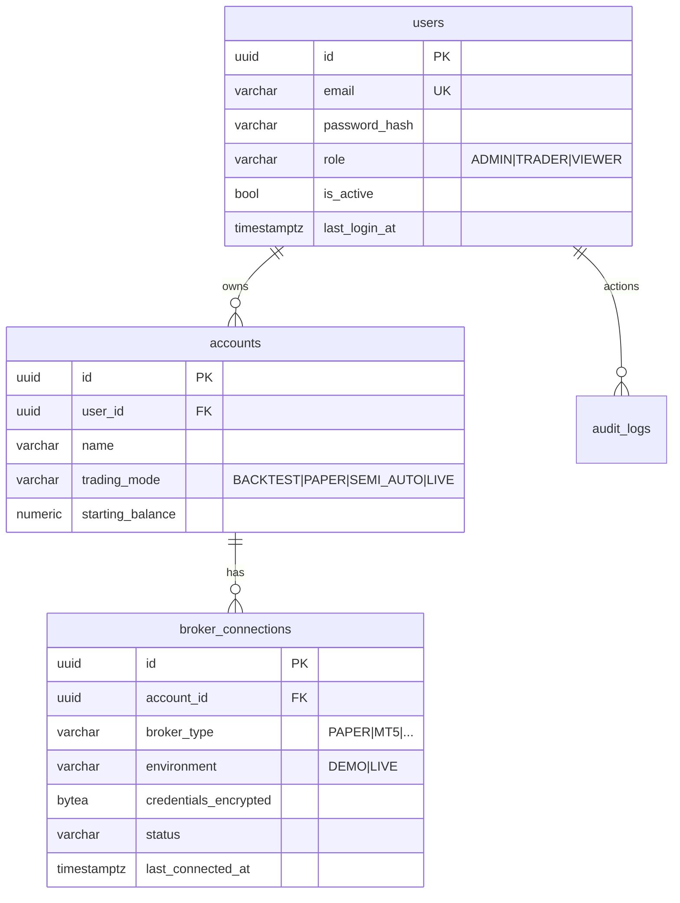
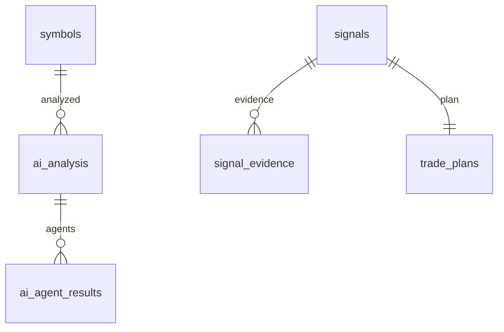
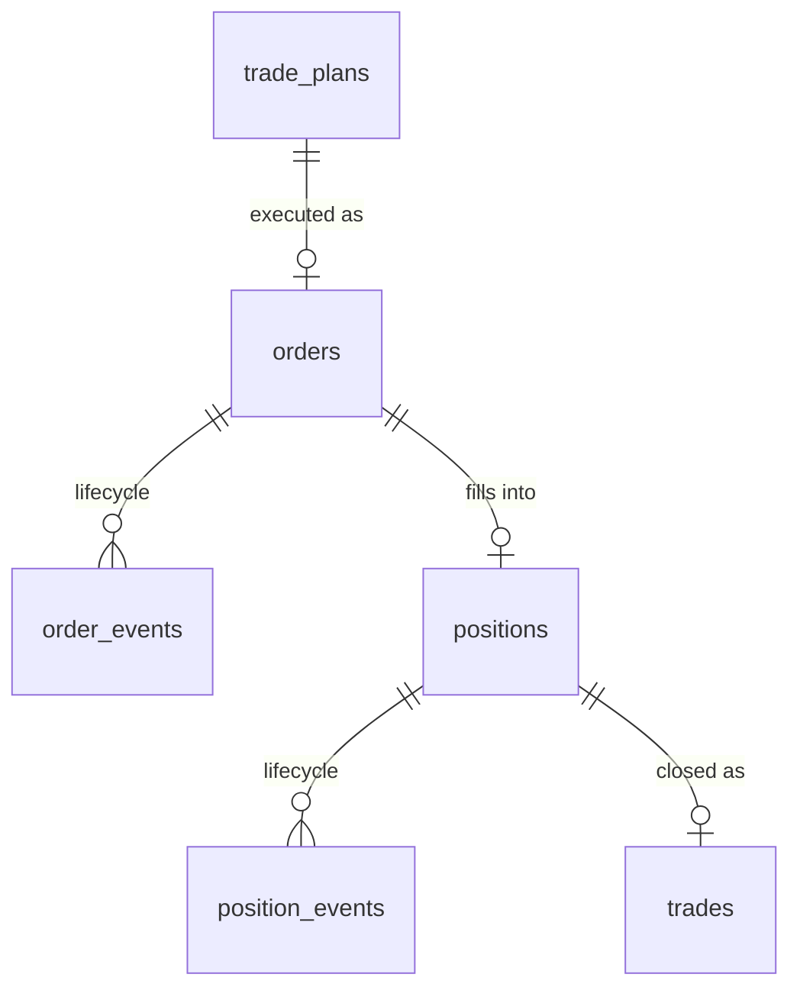

# 04 — Database Design (ERD และ Schema)

| รายการ | รายละเอียด |
|---|---|
| เอกสาร | docs/04-database-design.md |
| เวอร์ชัน | 1.0 (2026-09-08) |
| สถานะ | ✅ Baseline — migration ทุกตัวต้องตรงกับเอกสารนี้ (เปลี่ยนแปลงผ่าน Change Log ของเอกสาร) |
| Engine | PostgreSQL 16 + TimescaleDB (ดู ADR-003) |

**หลักการ:** ทุกตารางมี `id` (UUID PK), `created_at`, `updated_at` (นอกจากระบุอื่น) — ในตารางด้านล่างระบุเฉพาะคอลัมน์เฉพาะทาง ตัวอย่างประเภทข้อมูล: `timestamptz`, `numeric(18,5)` สำหรับราคา XAUUSD, `numeric(12,4)` สำหรับ size/PnL

---

## 1. ERD แบบแยก Domain

### 1.1 Identity & Access



### 1.2 Market Data (TimescaleDB hypertables)

```mermaid
erDiagram
    symbols ||--o{ ticks : "quotes"
    symbols ||--o{ candles : "ohlc"
    symbols {
        uuid id PK
        varchar name UK "XAUUSD"
        varchar asset_class
        smallint digits
        numeric contract_size
        numeric tick_value
        jsonb session_hours
        bool is_active
    }
    ticks {
        bigint ts "pk part"
        uuid symbol_id "pk part"
        numeric bid
        numeric ask
        numeric spread
        numeric volume
    }
    candles {
        bigint bucket_start "pk part"
        uuid symbol_id "pk part"
        varchar timeframe "pk part M1..W1"
        numeric open high low close
        numeric volume
        bool is_closed
    }
```

- `ticks`, `candles` = **hypertables** (chunk = 1 วัน ticks / 1 เดือน candles) + retention policy (config ได้)
- Index: candles `(symbol_id, timeframe, bucket_start DESC)`

### 1.3 Analysis (ผล engines — เก็บ snapshot ต่อรอบวิเคราะห์)



การวิเคราะห์ (structure/liquidity/smc/indicators/regime/bias) เก็บเป็น **`analysis_snapshots`** (แม้ Spec ไม่ระบุตารางนี้ เพิ่มเพื่อรองรับ FR-AN) — เก็บ JSONB ต่อ (symbol, timeframe, computed_at) พร้อมเวอร์ชัน engine — รายละเอียดใน Section 2.3

### 1.4 Trading Core



### 1.5 Risk / AI / Ops — ดูรายการตารางเต็มด้านล่าง

## 2. ตารางทั้งหมด (30 ตารางหลัก + 1 เสริม)

### 2.1 Identity & Access (3)

| ตาราง | คอลัมน์สำคัญ | หมายเหตุ |
|---|---|---|
| **users** | email (UK), password_hash, role, is_active, last_login_at, mfa_enabled (MFA-ready) | |
| **accounts** | user_id FK, name, trading_mode, starting_balance, base_currency | trading mode ต่อบัญชี + guard INV-08 |
| **broker_connections** | account_id FK, broker_type, environment (DEMO/LIVE), credentials_encrypted, status, last_connected_at | เข้ารหัส AES-GCM (FR-SE-02) |

### 2.2 Market Data (3)

| ตาราง | คอลัมน์สำคัญ | หมายเหตุ |
|---|---|---|
| **symbols** | name UK, asset_class, digits, contract_size, tick_value, min_stop_distance, session_hours JSONB, is_active | seed XAUUSD ใน PHASE 2 |
| **ticks** | ts, symbol_id, bid, ask, spread, volume | hypertable |
| **candles** | bucket_start, symbol_id, timeframe, open, high, low, close, volume, is_closed | hypertable; unique (symbol_id, timeframe, bucket_start) |

### 2.3 Analysis (4 — เพิ่ม analysis_snapshots จาก Spec)

| ตาราง | คอลัมน์สำคัญ | หมายเหตุ |
|---|---|---|
| **analysis_snapshots** | symbol_id, timeframe, computed_at, engine_version, structure JSONB, liquidity JSONB, smc JSONB, indicators JSONB, regime, bias | เพิ่มจาก Spec เพื่อเก็บผล engines + replay ย้อนหลัง; retention ตาม config |
| **strategies** | code UK, name, description, default_params JSONB, supported_regimes [], is_active | registry ของ strategy |
| **strategy_configs** | strategy_id FK, account_id FK, trading_style, params JSONB, min_confluence_score, is_enabled | unique (strategy_id, account_id, trading_style) |
| **economic_events** | event_type (CPI/NFP/FOMC/...), impact (HIGH/MED/LOW), currency, event_time, actual/forecast/previous, source | sync โดย news_worker |

### 2.4 Signals & Plans (3)

| ตาราง | คอลัมน์สำคัญ | หมายเหตุ |
|---|---|---|
| **signals** | symbol_id, strategy_id, account_id, direction, status, trading_style, timeframe_entry, confluence_score, ai_analysis_id FK?, expires_at, invalidation_price | index (status, expires_at) สำหรับ sweeper |
| **signal_evidence** | signal_id FK, source (engine/agent), type, detail JSONB, weight, created_at | audit ของ confluence (FR-ST-06) |
| **trade_plans** | signal_id FK UK(1:1), entry_type, entry_price, entry_zone_from/to, stop_loss, tp1, tp2, tp3, risk_reward, risk_percent, position_size, session, market_regime, confidence, invalidation, expires_at | ครบตาม Spec หัวข้อ 18 |

### 2.5 Orders & Positions (6)

| ตาราง | คอลัมน์สำคัญ | หมายเหตุ |
|---|---|---|
| **orders** | account_id, signal_id FK?, plan_id FK, side, order_type, requested_size, filled_size, price, sl, tp, state, idempotency_key UK, client_order_id UK, broker_order_id?, broker_type, tif, error_reason? | **UK สองชุด** คือหัวใจ duplicate protection (INV-03) |
| **order_events** | order_id FK, from_state, to_state, actor (USER/SYSTEM/WORKER/BROKER), reason, correlation_id, payload JSONB, created_at | append-only |
| **positions** | account_id, order_id FK, symbol_id, side, size_opened, size_remaining, entry_price, current_sl, current_tp, state, opened_at, closed_at, exit_reason?, realized_pnl? | |
| **position_events** | position_id FK, event_type (BE_MOVE/TRAIL/PARTIAL_CLOSE/MODIFY/CLOSE), detail JSONB, price_at_event, created_at | append-only |
| **trades** | position_id FK, journal auto-source, entry/exit, size, pnl, pnl_pct, mfe, mae, duration_sec, exit_reason, opened_at, closed_at | 1 ต่อ position ปิด (รวม partial ในตารางเดียว) |
| **journal_entries** | trade_id FK, notes, tags [], emotion/tags manual, screenshot_ref, created_at, updated_at | manual layer บน trades (auto ใน PHASE 8) |

### 2.6 Risk (3)

| ตาราง | คอลัมน์สำคัญ | หมายเหตุ |
|---|---|---|
| **risk_configs** | account_id FK UK, risk_per_trade_pct, max_daily_loss_pct, max_weekly_loss_pct, max_drawdown_pct, max_concurrent_trades, max_symbol_exposure_pct, max_correlated_exposure_pct, min_risk_reward, max_spread, max_slippage, min_free_margin_pct, news_window_config JSONB, session_restriction JSONB, is_active | แก้ไขผ่าน API + audit before/after |
| **risk_events** | account_id, subject (order/signal id), decision (APPROVED/REJECTED/REDUCE_SIZE/WAIT), reasons JSONB, context JSONB, created_at | ทุก decision บันทึกเสมอ |
| **kill_switch_state** | account_id UK, state (ACTIVE/TRIGGERED), trigger_reason, triggered_at, reset_by?, reset_at?, notes | 1 row ต่อ account |

### 2.7 AI (2)

| ตาราง | คอลัมน์สำคัญ | หมายเหตุ |
|---|---|---|
| **ai_analysis** | account_id?, symbol_id, timeframes [], bias, confidence, confidence_breakdown JSONB, recommendation JSONB (schema ตาม docs/03 §9), narrative, model, provider, latency_ms, validation_status, created_at | ทุกผล AI เก็บไว้ตรวจย้อนหลัง |
| **ai_agent_results** | ai_analysis_id FK, agent_name, status, output JSONB, evidence JSONB, latency_ms, error? | 9 agents (FR-AI-02) |

### 2.8 Paper Trading (3)

| ตาราง | คอลัมน์สำคัญ | หมายเหตุ |
|---|---|---|
| **paper_accounts** | account_id FK UK, balance, equity, floating_pnl, realized_pnl_today/week, drawdown_current, peak_equity, config JSONB (spread/commission/slippage model) | |
| **paper_orders** | โครงเหมือน orders + fill_simulation JSONB (slippage/commission ที่ใช้จริง) | แยกจาก live เพื่อความชัด (FR-TR-03) |
| **paper_positions** | โครงเหมือน positions + virtual fills | |
| *(paper equity history)* | เพิ่ม **paper_equity_history** (ts, balance, equity, drawdown) | เพิ่มจาก Spec เพื่อ equity curve ของ paper |

### 2.9 Backtesting (2)

| ตาราง | คอลัมน์สำคัญ | หมายเหตุ |
|---|---|---|
| **backtest_runs** | account_id, strategy_id, config JSONB (period, TF, cost model, session/news filter), status, metrics JSONB (ทุก metric ตาม Spec 25), equity_curve JSONB, walk_forward JSONB, started_at, finished_at, error? | |
| **backtest_trades** | run_id FK, ฟิลด์เหมือน trades + in_sample bool | เทียบกับ paper/live ได้ (FR-BT) |

### 2.10 Ops & Audit (4)

| ตาราง | คอลัมน์สำคัญ | หมายเหตุ |
|---|---|---|
| **alerts** | user_id?, account_id?, type, severity, title, payload JSONB, is_read, created_at | index (user_id, is_read) |
| **audit_logs** | ts, user_id?, action, entity, entity_id, before JSONB?, after JSONB?, reason?, source (API/WORKER/SYSTEM), correlation_id, ip? | append-only; ตาม Spec หัวข้อ 35 ครบทุกฟิลด์ |
| **system_events** | ts, category (DATA/BROKER/AI/DB/REDIS/WS), severity, code, message, payload JSONB, correlation_id | monitoring + kill switch อ้างอิง |
| **sessions** | user_id, refresh_token_hash, expires_at, revoked_at?, ip, user_agent | secure session (FR-SE-01) |

> **สรุปจำนวน:** ตารางหลักตาม Spec 30 ตาราง (users, accounts, broker_connections, symbols, ticks, candles, strategies, strategy_configs, signals, signal_evidence, trade_plans, orders, order_events, positions, position_events, trades, risk_configs, risk_events, ai_analysis, ai_agent_results, economic_events, alerts, journal_entries, backtest_runs, backtest_trades, paper_accounts, paper_orders, paper_positions, audit_logs, system_events) **+ เสริม 3 ตาราง:** analysis_snapshots, paper_equity_history, sessions (เพิ่มเพื่อรองรับ requirement ที่ระบุแต่ไม่มีตารางรองรับโดยตรง)

## 3. นโยบายสำคัญ

- **Append-only:** order_events, position_events, risk_events, audit_logs, ai_agent_results — ห้าม UPDATE/DELETE (ผ่าน DB permission + code review)
- **Idempotency:** unique constraints บน orders.idempotency_key และ orders.client_order_id (+ paper_orders) — จับ conflict = คืน order เดิม (INV-03)
- **TimescaleDB:** hypertables สำหรับ ticks/candles + compression (candles > 7 วัน) + retention (config ต่อ env)
- **Migration:** Alembic — ทุก schema change ผ่าน migration + ต้อง update เอกสารนี้พร้อมกัน (Definition of Done)
- **Transaction boundary:** การเปลี่ยน state ของ order/position = transaction เดียว (state + event + audit commit พร้อมกัน — INV-06)
- **Encryption:** broker_connections.credentials_encrypted เข้ารหักที่ application layer ก่อนเก็บ (key จาก env — ห้าม hardcoded)

## 4. ERD ความสัมพันธ์ระดับบน (ภาพรวม)

```
users ─1:N─ accounts ─1:N─ broker_connections
accounts ─1:N─ [signals ─1:1─ trade_plans ─1:N─ orders ─1:N─ order_events]
                                │ orders ─0/1:1─ positions ─1:N─ position_events
                                │ positions ─1:1─ trades ─1:0/1─ journal_entries
accounts ─1:1─ risk_configs / kill_switch_state / paper_accounts
accounts ─1:N─ risk_events / backtest_runs ─1:N─ backtest_trades
symbols ─1:N─ ticks / candles / analysis_snapshots / signals / ai_analysis
ai_analysis ─1:N─ ai_agent_results
users ─1:N─ audit_logs / sessions / alerts
(economic_events, system_events: อิสระ)
```
